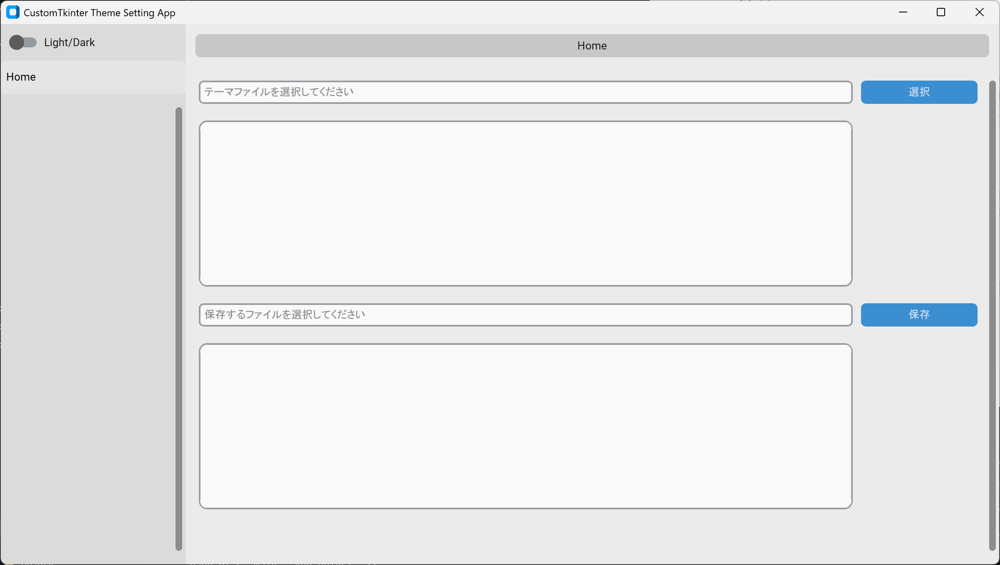
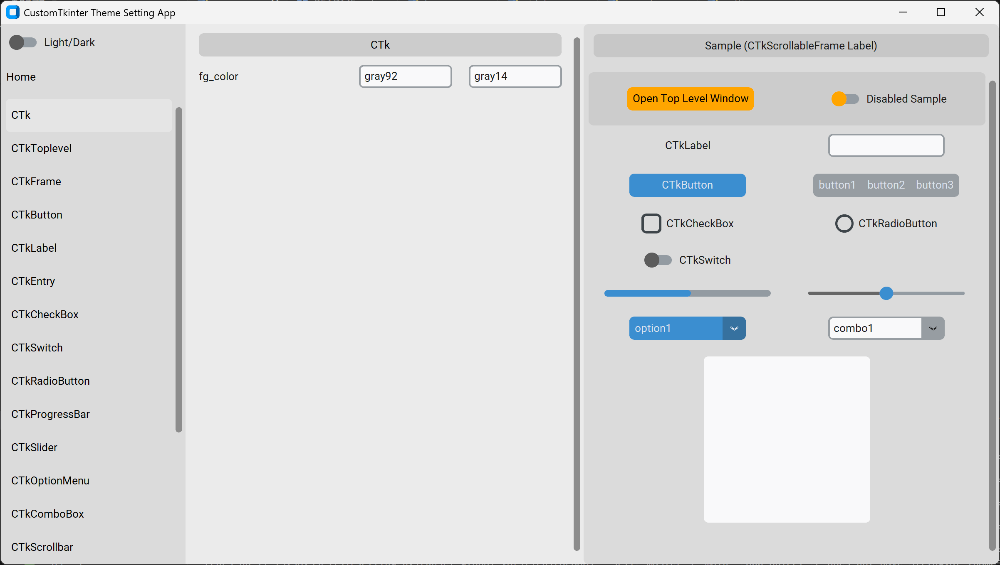

<!--
    README
 -->

# Customtkinter Create Theme App

<!-- [](./README.md) -->
<!-- [](./README_JA.md) -->
[](./README.md)
[](./LICENSE)
[](https://mypy-lang.org/)
[](https://github.com/astral-sh/ruff)
[](https://github.com/astral-sh/uv)

[](https://github.com/python)
[](https://github.com/sphinx-doc/sphinx)
[](https://github.com/pytest-dev/pytest)
[](https://github.com/pydantic/pydantic)

`CustomTkinter`のテーマファイルを作成するGUIアプリです。

`CustomTkinter`では下記のように予め用意されたテーマを使用できます。

またファイルのパスを指定することで、自作のテーマも使用できます。

```python
import customtkinter as ctk
ctk.set_default_color_theme(color_string='blue') # blue, dark-blue, green
```

## Getting started

### githubからインストール

```bash
git clone https://github.com/r-dev95/customtkinter-create-theme-app.git
```

### 仮想環境の構築

`uv`がインストールされていることが前提です。

pythonの開発環境がまだ整っていない方は、[こちら](https://github.com/r-dev95/env-python)。

```bash
cd customtkinter-create-theme-app/
uv sync
```

### 実行

```bash
cd src
python app.py
```

## 画面と機能

### Home画面



|項目                   |機能                            |
| ---                   | ---                            |
|Light/Darkトグルボタン |ライト/ダークモードの切り替え。 |
|サイドバーボタン(Home) |Home画面の表示。                |
|選択ボタン             |ベースのテーマファイルの選択。  |
|保存ボタン             |設定したテーマのファイル保存。  |

### 各設定画面 (Home画面以外)



|項目                       |機能                               |
| ---                       | ---                               |
|サイドバーボタン(Home以外) |各ウィジェットの設定画面の表示。   |
|画面中央の各テキストエリア |ウィジェットテーマの設定。         |
|画面右の各ウィジェット     |テーマ設定に応じたサンプルの表示。 |

※カラー設定の場合、左のテキストエリアがライトモード用、右がダークモード用です。

## 使い方

* Home画面の選択ボタンを押して、ベースとなるテーマファイルを選択します。

  選択したテーマファイルに応じて、各ウィジェットの設定画面が生成されます。

* 各ウィジェットの設定画面で好みのテーマ設定を行います。

  設定はリアルタイムにサンプル画面(画面右)もしくは本アプリ自体に反映され、確認ができます。

* 設定が終わったら、Home画面の保存ボタンを押して、テーマファイルを作成します。

## 補足

* `CTk`の設定は、サンプル画面ではなく本アプリ自体に反映されます。
* `DropdownMenu`の設定は、`CTkOptionMenu`と`CTkComboBox`に反映されます。
* `CTkToplevel`の設定は、サンプル画面の`Open Top Level Window`ボタンを押して、ウィンドウを表示させて確認してください。
* `***_disabled`の設定は、`Disabled Sample`トグルボタンを押して確認してください。
* `CTkFrame`をインスタンス化する際、親と自身の`fg_color`が同じ場合、CustomTkinter内部で`fg_color`の代わりに`top_fg_color`が設定される。

  そのため`top_fg_color`は、テーマ変更を`.configure`で反映させる本アプリでは、確認できません。

## ライセンス

本リポジトリは、[MIT License](LICENSE)に基づいてライセンスされています。
