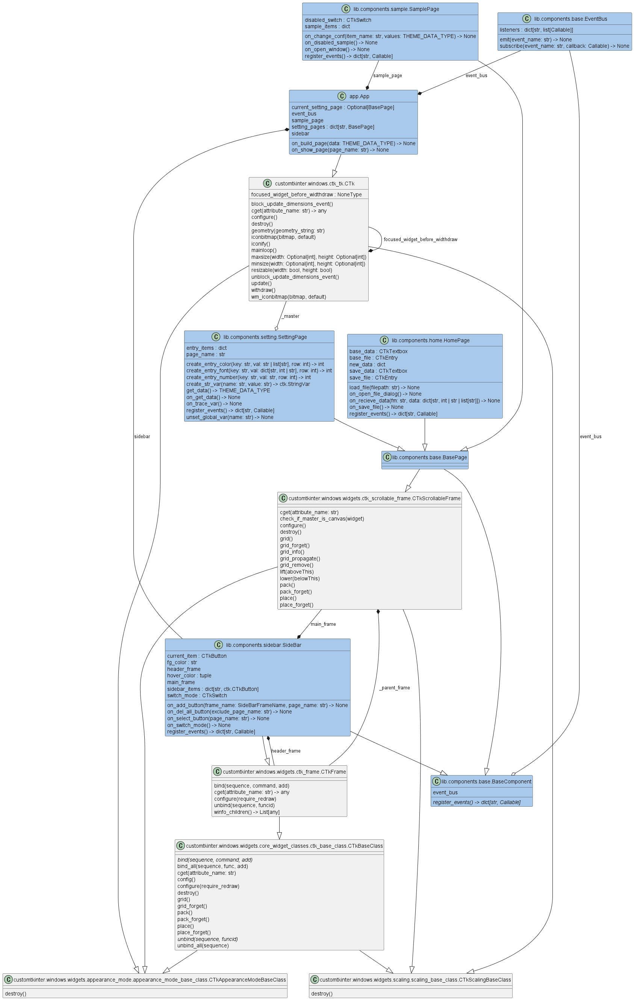

<!-- ============================================================
  Project Image
 ============================================================ -->
<div align=center>
  
</div>

<!-- ============================================================
  Overview
 ============================================================ -->
# :book:Overview

[](./README.md)
[](./README_JA.md)
[](./LICENSE)
[](https://mypy-lang.org/)
[](https://github.com/astral-sh/ruff)
[](https://github.com/astral-sh/uv)

[](https://github.com/python)
[](https://github.com/sphinx-doc/sphinx)
[](https://github.com/pytest-dev/pytest)
[](https://github.com/pydantic/pydantic)

This is a GUI app to create CustomTkinter theme files.

With this app, you can easily create your own theme files while checking the widget theme in real time.

> [!note]
> CustomTkinter allows you to use pre-prepared themes.
> You can also use your own themes by specifying the file path.
>
> ```python
> import customtkinter as ctk
> ctk.set_default_color_theme(color_string='blue') # blue, dark-blue, green
> ```

<!-- ============================================================
  Features
 ============================================================ -->
## :desktop_computer:Features

### Home page

<div align=center>
  
</div>

|Item                     |Features                              |
| ---                     | ---                                  |
|Light/Dark toggle button |Light/dark mode toggle.               |
|Sidebar button (Home)    |Display the Home page.                |
|Select button            |Select the base theme file.           |
|Save button              |Save the file with the theme you set. |

### Setting page (Other than the Home page)

<div align=center>
  
</div>

|Item                                   |Features                                     |
| ---                                   | ---                                         |
|Sidebar buttons (Other than Home)      |Display the settings page of each widget.    |
|Each text area (center of screen)      |Set the widget theme.                        |
|Each widget (right side of the screen) |Display samples according to theme settings. |

※For color, the text area on the left is for light mode and the one on the right is for dark mode.

<!-- ============================================================
  Usage
 ============================================================ -->
## :keyboard:Usage

### Install

```bash
git clone https://github.com/r-dev95/customtkinter-create-theme-app.git
```

### Build virtual environment

You need to install `uv`.

If you don't have a python development environment yet, see [here](https://github.com/r-dev95/env-python).

```bash
cd customtkinter-create-theme-app/
uv sync
```

### Run

```bash
cd src
uv run python app.py
```

- Press the Select button on the Home page to select the base theme file.

  Depending on the theme file you select, a settings page for each widget will be generated.

- You set the theme on each widget's settings page.

  You can check the settings in real time on the sample page (right side of the screen) or in the app itself.

- Once you have finished the settings, press the Save button on the Home page to create the theme file.

> [!note]
>
> - The `CTk` setting is reflected in this app itself, not the sample page.
> - The settings of `DropdownMenu` are reflected in `CTkOptionMenu` and `CTkComboBox`.
> - To check the `CTkToplevel` settings, click the `Open Top Level Window` button on the sample page to display the window.
> - To check the `***_disabled` settings, press the `Disabled Sample` toggle button.
> - When instantiating a `CTkFrame`, if the parent's and its `fg_color` are the same, `top_fg_color` will be set instead of `fg_color` inside CustomTkinter.
>
>   Therefore, `top_fg_color` cannot be checked in this app, where theme changes are reflected in `.configure`.

<!-- ============================================================
  Structure
 ============================================================ -->
## :bookmark_tabs:Structure

<div align=center>
  
</div>

<!-- ============================================================
  License
 ============================================================ -->
## :key:License

This repository is licensed under the [MIT License](LICENSE).
