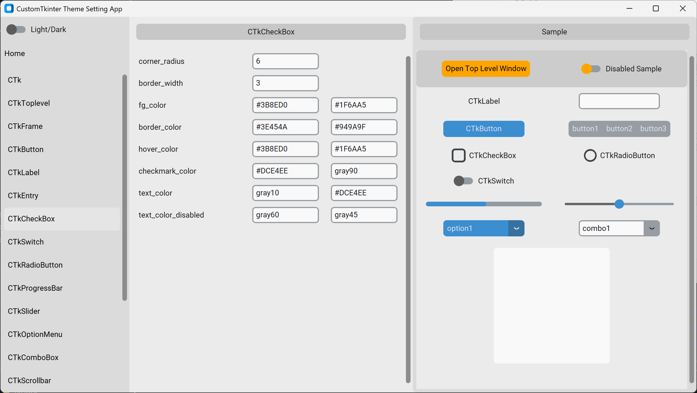
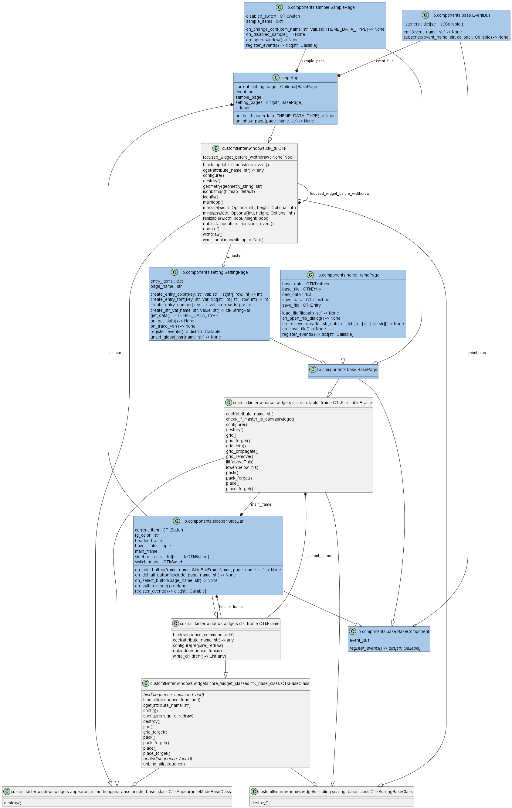

<!-- ============================================================ -->
<!-- Project Image -->
<!-- ============================================================ -->
<div align=center>
  
</div>

<!-- ============================================================ -->
<!-- Overview -->
<!-- ============================================================ -->
# Overview

[](./README.md)
[](./README_JA.md)
[](./LICENSE)
[](https://mypy-lang.org/)
[](https://github.com/astral-sh/ruff)
[](https://github.com/astral-sh/uv)

[](https://github.com/python)
[](https://github.com/sphinx-doc/sphinx)
[](https://github.com/pytest-dev/pytest)
[](https://github.com/pydantic/pydantic)

CustomTkinterのテーマファイルを作成するGUIアプリです。

本アプリでは、ウィジェットのテーマをリアルタイムに確認しながら、テーマファイルを簡単に自作できます。

> [!note]
> CustomTkinterでは、予め用意されたテーマを使用できます。
> またファイルパスを指定することで、自作テーマも使用できます。
>
> ```python
> import customtkinter as ctk
> ctk.set_default_color_theme(color_string='blue') # blue, dark-blue, green
> ```

<!-- ============================================================ -->
<!-- Features -->
<!-- ============================================================ -->
## Features

### Home page

<div align=center>
  
</div>

|項目                    |機能                            |
| ---                    | ---                            |
|Light/Darkトグルボタン  |ライト/ダークモードの切り替え。 |
|サイドバーボタン (Home) |Homeページの表示。              |
|選択ボタン              |ベースのテーマファイルの選択。  |
|保存ボタン              |設定したテーマのファイル保存。  |

### Setting page (Other than the Home page)

<div align=center>
  
</div>

|項目                        |機能                               |
| ---                        | ---                               |
|サイドバーボタン (Home以外) |各ウィジェットの設定ページの表示。 |
|各テキストエリア (画面中央) |ウィジェットテーマの設定。         |
|各ウィジェット (画面右)     |テーマ設定に応じたサンプルの表示。 |

※カラーの場合、左のテキストエリアがライトモード用、右がダークモード用です。

<!-- ============================================================ -->
<!-- Usage -->
<!-- ============================================================ -->
## Usage

### Install

```bash
git clone https://github.com/r-dev95/customtkinter-create-theme-app.git
```

### Build virtual environment

`uv`がインストールされていることが前提です。

pythonの開発環境がまだ整っていない方は、[こちら](https://github.com/r-dev95/env-python)。

```bash
cd customtkinter-create-theme-app/
uv sync
```

### Run

```bash
cd src
uv run python app.py
```

- Homeページの選択ボタンを押して、ベースとなるテーマファイルを選択します。

  選択したテーマファイルに応じて、各ウィジェットの設定ページが生成されます。

- 各ウィジェットの設定ページで好みのテーマ設定を行います。

  サンプルページ(画面右)または本アプリ自体に、設定はリアルタイムに反映され確認ができます。

- 設定が終わったら、Homeページの保存ボタンを押して、テーマファイルを作成します。

> [!note]
>
> - `CTk`の設定は、サンプルページではなく本アプリ自体に反映されます。
> - `DropdownMenu`の設定は、`CTkOptionMenu`と`CTkComboBox`に反映されます。
> - `CTkToplevel`の設定は、サンプルページの`Open Top Level Window`ボタンを押して、ウィンドウを表示させて確認してください。
> - `***_disabled`の設定は、`Disabled Sample`トグルボタンを押して確認してください。
> - `CTkFrame`をインスタンス化する際、親と自身の`fg_color`が同じ場合、CustomTkinter内部で`fg_color`の代わりに`top_fg_color`が設定される。
>
>   そのため`top_fg_color`は、テーマ変更を`.configure`で反映させる本アプリでは、確認できません。

<!-- ============================================================ -->
<!-- Structure -->
<!-- ============================================================ -->
## :bookmark_tabs:Structure

<div align=center>
  
</div>

<!-- ============================================================ -->
<!-- License -->
<!-- ============================================================ -->
## License

本リポジトリは、[MIT License](LICENSE)に基づいてライセンスされています。
